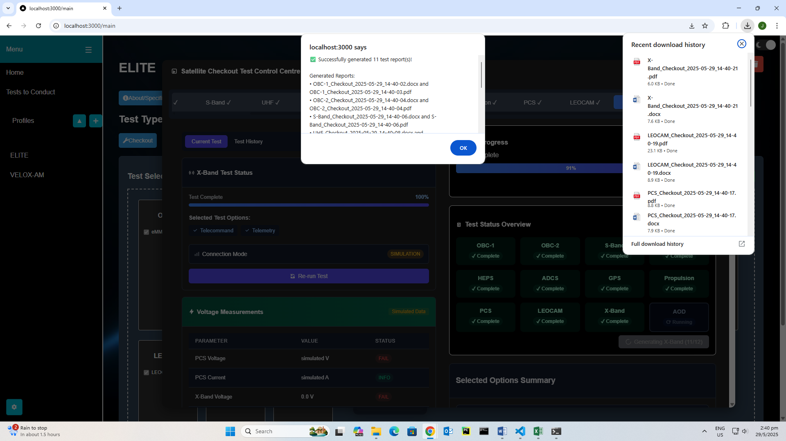

# 🛰️ SATS (Satellite Automated Testing System)

<!-- Row 1 -->
<p align="center">
  
  
</p>
<!-- Row 2 -->
<p align="center">
  
  
</p>
<!-- Row 3 -->
<p align="center">
  
  
</p>
<!-- Row 4 -->
<p align="center">
  
  
</p>
<!-- Row 5 -->
<p align="center">
  
  
</p>
<!-- Row 6 -->
<p align="center">
  
  
</p>
<!-- Row 7 -->
<p align="center">
  
  
</p>

## Overview
SATS is a comprehensive system designed to automate satellite testing processes. It provides engineers and operators with powerful tools for hardware checkout, system verification, and test execution. The system consists of:

- **Backend**: A Python-based Flask server that handles core functionalities, data management, and hardware communication
- **Frontend**: A React/TypeScript application with an intuitive user interface for test configuration, execution, and reporting
- **MCC Proxy**: A Node.js-based proxy for real hardware communication

This system supports efficient satellite testing workflows and includes features like dynamic profile creation, test management, automated checkout testing, comprehensive reporting and 3D model visualization. SATS brings an enhanced user experience to the day-to-day satellite testing processes across 11 satellite subsystem tests.

---

## 🎯 Key Features

- **Profile Management**: Create, Edit, or Delete Profiles. Customizable persistent test profiles - About/Specifications Section, Checkout Test drag-and-drop selection, Satellite Model Viewer
- **Profile About/Specifications**: Supports user uploads, in-app edits of text, images and formatting
- **Profile Checkout Test Selection**: Drag-and-Drop component selection for customised testing
- **Profile Test History**: Tracking and visualization of various parameters across 11 tests. Supports data export in .json
- **Profile Satellite Model Viewer**: View and interact with user uploaded .glb 3D models of satellites. Shows Stats of file.
- **Persistent To Test List**: Update and Track tests to be conducted, with notification at the Welcome Page
- **Floating Window System**: Multi-window interface with draggable, resizable, bring-to-front components, minimizable ServerWindow to TaskBar
- **Light/Dark Mode, Font & Background Settings**: Comprehensive theming system with persistent preferences


### Testing & Hardware Integration

- **Multiple Subsystem Support**: Supports 11 satellite subsystem tests
- **Automated Testing System**: Component-specific test panels with real-time progress tracking
- **Test Report Generation**: Automatically generates and downloads detailed .docx and .pdf-format test reports after selected tests completion
- **MCC Connection**: Connect to actual Mission Control Center servers
- **Simulation Mode**: Simulation fallback for further development of SATS

### Others

- **Model Optimization**: Automatic optimization of uploaded 3D models in Satellite Model Viewer
- **Taskbar Integration**: Minimizable Server window with status tracking while working
- **Process Script Manager**: Launch `start-sats.bat` to run all SATS frontend, backend, MCC Proxy processes. Various in-console commands.
- **SATS Diagnostic Tool**: Run `diagnose.js` for error identification in running SATS
- **Frontend, Backend, MCC Proxy Logs**: Logs saved in the `logs/` directory
- **User-Friendly prompts, insightful console logs**

---

## 📂 Project Structure

```
SATS Satellite Automated Testing System/
│-- SATS_images_in_README/
│-- backend/
│   ├── .env                      # backend environment variables
│   ├── backend_server.py         # Flask server and API endpoints
│   ├── mccif.py                  # MCC server communication module
│   ├── requirements.txt          # Python dependencies
│   ├── models/                   # Directory for uploaded 3D models
│   ├── satellites.db             # SQLite database
│   ├── SQLiteDatabaseREADME.md   # satellites.db SQLite Database Schema (Entity Relationship Diagram)
│   ├── venv                      # virtual environment
│
│-- mcc-proxy/
│   ├── mcc-proxy.js          # Node.js proxy server for MCC communication
│
│-- beautify frontend/
│   ├── .env                  # frontend environment variables
│   ├── src/
│   │   ├── app/              # Core application structure
│   │   │   ├── globals.css   # Global styles
│   │   │   ├── layout.tsx    # Root layout with theme switching
│   │   │   ├── page.tsx      # Main entry point
│   │
│   │   ├── components/                            # UI components
│   │   │   ├── MainScreen/                        # Main application screen
│   │   │       ├── MainScreen.tsx                 
│   │   │       ├── MainScreen.module.css       
│   │   │       ├── DraggableBox.tsx               # Drag-and-Drop functionality   
│   │   │   
│   │   │   ├── ServerWindow/                      # MCC server connection
│   │   │       ├── ServerWindow.tsx
│   │   │       ├── ServerWindow.module.css   
│   │   │       
│   │   │   ├── ToTestList/                        # Test management
│   │   │       ├── ToTestList.tsx
│   │   │       ├── ToTestList.module.css  
│   │   │   
│   │   │   ├── WelcomeWindow/                     # Welcome screen
│   │   │       ├── WelcomeWindow.tsx
│   │   │       ├── WelcomeWindow.module.css  
│   │   │      
│   │   │   ├── ModelWindow/                       # 3D model visualization
│   │   │       ├── ThreeDModelWindow.jsx
│   │   │       ├── ThreeDModelWindow.module.css  
│   │   │   
│   │   │   ├── Taskbar/                           # Window management taskbar
│   │   │       ├── Taskbar.tsx
│   │   │       ├── Taskbar.module.css  
│   │   │   
│   │   │   ├── SettingsWindow/                    # Settings
│   │   │       ├── SettingsWindow.tsx
│   │   │       ├── SettingsWindow.module.css
│   │   │   
│   │   │   ├── FontLoader/                        # Fonts in SettingsWindow
│   │   │       ├── FontLoader.tsx
│   │   │     
│   │   │   ├── ui/                                # reusable UI elements
│   │   │       ├── alert.tsx
│   │   │       ├── button.tsx
│   │   │       ├── card.tsx
│   │   │       ├── progress.tsx
│   │   │       ├── tabs.tsx
│   │   │       ├── index.ts                       # Export UI elements
│   │   │   
│   │   │   ├── CheckoutTestProgress/              # Test execution
│   │   │   │   ├── CheckoutTestProgress.tsx
│   │   │   │   ├── CheckoutTestProgress.module.css
│   │   │   │   ├── components/
│   │   │   │       ├── OBC1TestPanel.tsx          # OBC-1 test
│   │   │   │       ├── OBC1TestPanel.module.css   # reusable base CSS
│   │   │   │       ├── OBC2TestPanel.tsx          # OBC-2 test
│   │   │   │       ├── SBandTestPanel.tsx         # S-Band test
│   │   │   │       ├── SBandTestPanel.module.css  # SBand styles in addition to base CSS
│   │   │   │       ├── UHFTestPanel.tsx           # UHF test
│   │   │   │       ├── ADCSTestPanel.tsx          # ADCS test
│   │   │   │       ├── GPSTestPanel.tsx           # GPS test
│   │   │   │       ├── HEPSTestPanel.tsx          # HEPS test
│   │   │   │       ├── PCSTestPanel.tsx           # PCS test
│   │   │   │       ├── PropulsionTestPanel.tsx    # Propulsion test
│   │   │   │       ├── LEOCAMTestPanel.tsx        # LEOCAM test
│   │   │   │       ├── XBandTestPanel.tsx         # X-Band test
│   │   │   │       ├── TestDetailsModal.tsx       # reusable component for Test History
│   │   │   │       ├── TestHistoryChart.tsx       # reusable component for Test History
│   │   │   │       ├── TestHistoryTable.tsx       # reusable component for Test History
│   │   │   │       ├── index.ts                   # component exports
│   │
│   │   ├── services/         # Business services
│   │   │   ├── checkout/     # Test execution services
│   │   │   │   ├── obc1Checkout.ts
│   │   │   │   ├── obc2Checkout.ts
│   │   │   │   ├── sbandCheckout.ts
│   │   │   │   ├── uhfCheckout.ts
│   │   │   │   ├── adcsCheckout.ts
│   │   │   │   ├── gpsCheckout.ts
│   │   │   │   ├── hepsCheckout.ts
│   │   │   │   ├── pcsCheckout.ts
│   │   │   │   ├── propulsionCheckout.ts
│   │   │   │   ├── leocamCheckout.ts
│   │   │   │   ├── xbandCheckout.ts
│   │   │   ├── reports/      # Report generation
│   │   │       ├── obc1Report.ts
│   │   │       ├── obc2Report.ts
│   │   │       ├── sbandReport.ts
│   │   │       ├── uhfReport.ts
│   │   │       ├── adcsReport.ts
│   │   │       ├── gpsReport.ts
│   │   │       ├── hepsReport.ts
│   │   │       ├── pcsReport.ts
│   │   │       ├── propulsionReport.ts
│   │   │       ├── leocamReport.ts
│   │   │       ├── xbandReport.ts
│   │
│   │   ├── utils/            # Utility functions
│   │   │   ├── mccUtils.ts   # MCC communication
│   │   │   ├── themeInitializer.ts # Theme management
│   │   │   ├── themeEvents.ts # Theme event system
│   │
│   │   ├── lib/              # Library functions
│   │   │   ├── utils.ts      # General utilities
│   │
│   │   ├── types/            # TypeScript definitions
│   │       ├── types.ts
│
│   ├── image.d.ts            # TypeScript declaration file to handle image type
│
│   ├── package.json          # Node dependencies
│   ├── tsconfig.json         # TypeScript configuration
│   ├── .env                  # Environment variables
│
│-- logs/                     # Log directory for services
│
│-- start-sats.bat            # Windows startup script
│-- sats-manager.js           # Process management script
│-- diagnose.js               # System diagnostic tool
│-- .gitignore
│-- README.md                 # This file
```

---

## 🛠️ Prerequisites

Make sure the following are installed before running the project:

1. **Git**: [Download Git](https://git-scm.com/downloads)
2. **Python 3.7+**: [Download Python](https://www.python.org/downloads/)
3. **Node.js** (with npm): [Download Node.js](https://nodejs.org/)
4. **gltf-pipeline** (optional, for 3D model optimization): `npm install -g gltf-pipeline`

---

## 🚀 Setup Instructions

### Clone the Repository
Run the following commands in your terminal:
```bash
git clone https://github.com/JoeUIUX/SATS.git
cd "SATS Satellite Automated Testing System"
```

### Unified System Startup (Recommended)
SATS includes a process manager that handles all components simultaneously:

1. **From the project root directory**, run:
   ```bash
   node sats-manager.js
   ```
   
   Or on Windows, simply use the batch file:
   ```bash
   start-sats.bat
   ```

2. **Command reference** within the process manager:
   - `q` - Quit all processes
   - `r` - Restart all processes
   - `b` - Restart backend only
   - `p` - Restart proxy only
   - `f` - Restart frontend only
   - `s` - Show status of all processes
   - `l` - Show log paths
   - `h` - Display help
   - `c` - Clean/rotate log files

3. **Logs** are stored in the `logs/` directory for debugging.

4. **System diagnosis**: If you encounter issues, use the diagnosis tool:
   ```bash
   node diagnose.js
   ```

5. **Open the Application** in your browser:
   ```
   http://localhost:3000
   ```

### Manual Start Up
### 1️⃣ Backend Setup
Follow these steps to set up the backend:

1. **Navigate to the backend folder:**
   ```bash
   cd backend
   ```

2. **Create and activate a virtual environment:**
   
   For Windows:
   ```bash
   python -m venv venv
   venv\Scripts\activate
   ```
   
   For macOS/Linux:
   ```bash
   python -m venv venv
   source venv/bin/activate
   ```

3. **Install the required Python dependencies:**
   ```bash
   pip install -r requirements.txt
   ```

4. **Create a `.env` file** in the `backend` folder and add the following:
   ```env
   REACT_APP_BACKEND_URL=http://127.0.0.1:5000
   FLASK_PORT=5000
   SIMULATION_MODE=false
   FLASK_CORS_ENABLED=true
   ```

5. **Run the backend server manually:**
   ```bash
   python backend_server.py
   ```
   Or continue with the full setup to use the integrated process manager.

### 2️⃣ MCC Proxy Setup
The MCC proxy server enables real hardware communication:

1. **Navigate to the mcc-proxy folder:**
   ```bash
   cd ../mcc-proxy
   ```

2. **Install dependencies:**
   ```bash
   npm install ws net http
   ```

3. **Run the proxy server manually:**
   ```bash
   node mcc-proxy.js
   ```
   Or continue with the full setup to use the integrated process manager.

### 3️⃣ Frontend Setup
Follow these steps to set up the frontend:

1. **Navigate to the frontend folder:**
   ```bash
   cd "../beautify frontend"
   ```

2. **Install the frontend dependencies:**
   ```bash
   npm install
   ```

   This will install all dependencies listed in package.json, including:
   - UI component libraries (Radix UI, tailwindcss)
   - Drag and drop libraries
   - Document processing libraries
   - 3D libraries

3. **Run the frontend development server manually:**
   ```bash
   npm run dev
   ```
   Or continue with the full setup to use the integrated process manager.

---

## 📝 Environment Variables

### Environment Variables
In the `SATS Satellite Automated Testing System/.env` file:
```env
REACT_APP_BACKEND_URL=http://127.0.0.1:5000 
REACT_APP_MCC_SIMULATION=false 
REACT_APP_MCC_LOG_LEVEL=debug 
FLASK_CORS_ENABLED=true 
FLASK_CORS_ORIGINS=http://localhost:3000,http://127.0.0.1:3000 
```

### Backend Environment Variables
In the `backend/.env` file:
```env
FLASK_PORT=5000
```

### Frontend Environment Variables
In the `beautify frontend/.env` file:
```env
# Required: Backend server URL
REACT_APP_BACKEND_URL=http://127.0.0.1:5000

# Optional: Enable simulation mode for MCC
REACT_APP_MCC_SIMULATION=false

# Optional: Log level for MCC communication
REACT_APP_MCC_LOG_LEVEL=debug

# Add an explicit CORS configuration flag
FLASK_CORS_ENABLED=true
```

---

## 🔌 API Endpoints

### Profile Management
- `GET /profiles` - Get all profiles with descriptions and images
- `POST /profiles` - Create a new profile with description, images, and uploaded filename
- `PUT /profiles/<name>` - Update profile description, images, and uploaded filename
- `DELETE /profiles/<name>` - Delete a profile by name

### 3D Model Management
- `GET /api/profile/<int:profile_id>` - Get 3D model path for a specific profile ID
- `POST /api/upload-glb` - Upload and assign a GLB model to a profile (with optimization)
- `GET /models/<filename>` - Serve 3D model files with caching headers

### Test Management
- `GET /test-items` - Get all test items from database
- `POST /test-items` - Save/replace all test items in database
- `DELETE /test-items/<int:item_id>` - Delete a specific test item by ID
- `DELETE /test-items/clear` - Clear all test items from database

### Checkout Management
- `POST /checkout/save` - Save checkout items configuration for a profile
- `GET /checkout/load/<profile_id>` - Load saved checkout items for a profile
- `OPTIONS /checkout/save` - CORS preflight for checkout save
- `OPTIONS /checkout/load/<profile_id>` - CORS preflight for checkout load

### Test Results & History
- `GET /test-results/<profile_id>` - Get test results for a profile (with optional component filter)
- `POST /test-results` - Save a new test result with simulation tracking
- `POST /test-results/cleanup-simulated` - Remove all simulated test results from database
- `POST /test-results/limit/<profile_id>` - Limit test history records for a profile
- `DELETE /test-results/clear/<profile_id>` - Clear all test history for a profile (with optional component filter)
- `DELETE /test-results/<int:result_id>` - Delete a specific test result by ID

### MCC Connection
- `POST /connect_mcc` - Connect to MCC server with address, port, server_id, and proxy options

### Settings & Theme Management
- `GET /settings` - Get application settings (theme, font, backgrounds)
- `POST /settings` - Save application settings with automatic timestamp updates
- `GET /backgrounds` - Get available backgrounds (default and custom uploaded)
- `POST /upload-background` - Upload a custom background image
- `DELETE /backgrounds/<int:background_id>` - Delete a custom background
- `POST /apply-background` - Apply a background for specific theme mode (dark/light)
- `GET /assets/<filename>` - Serve static assets (backgrounds) with caching headers

---

## 📋 Dependencies

### Backend Dependencies
The Python backend requires the following dependencies (listed in `requirements.txt`):

- **Flask** – Web framework
- **Flask-Cors** – Cross-Origin Resource Sharing support
- **Flask-Compress** – Response compression for better performance
- **SQLite3** – Database management
- **python-dotenv** – Environment variable management
- **Requests** – HTTP request library

🔹 **Install all backend dependencies with:**
```bash
pip install -r requirements.txt
```

### MCC Proxy Dependencies
- **ws** - WebSocket implementation
- **net** - Network utilities
- **http** - HTTP server implementation

### Frontend Dependencies
The React frontend uses the following dependencies (defined in `package.json`):

#### Core Libraries
- **`react`, `react-dom`, `react-router-dom`** – Core React and routing
- **`@dnd-kit/sortable`, `@dnd-kit/core`, `@dnd-kit/utilities`** – Drag-and-drop functionality
- **`@tiptap/react`, `@tiptap/starter-kit`** – Rich text editing

#### UI Components
- **`@radix-ui/react-progress`, `@radix-ui/react-slot`, `@radix-ui/react-tabs`** - UI primitives
- **`class-variance-authority`, `clsx`, `tailwind-merge`, `tailwindcss`** - Styling utilities
- **`lucide-react`** - Icon library
- **`react-draggable`, `react-rnd`** - For draggable and resizable windows

#### Document Processing
- **`docx`** – Report generation
- **`file-saver`** - File download functionality
- **`papaparse`** - CSV parsing
- **`sheetjs`** - Excel file processing
- **`jspdf`** - PDF report generation

#### 3D Visualization
- **`three`** – 3D model rendering

🔹 **Install all frontend dependencies with:**
```bash
npm install
```

---

## 🔍 Troubleshooting

### System Startup Issues
If the entire system doesn't start properly:
- Run the diagnostic tool: `node diagnose.js`
- Check all service logs in the `logs/` directory
- Verify that all ports (3000, 5000, 8080) are available
- Make sure Node.js and Python are in your PATH

### Window Visibility Issues
If windows aren't appearing or showing correctly:
- Check the browser console for errors
- Clear browser sessionStorage and reload the page
- Ensure z-index values aren't conflicting with other components

### 3D Model Loading Problems
If 3D models don't load:
- Verify the model file is in GLB format
- Check file size (keep under 100MB for optimal performance)
- Ensure backend server is properly configured for file uploads
- Look for CORS issues in browser console

### Backend Connection Issues
If the frontend can't communicate with the backend:
- Verify backend server is running
- Check that REACT_APP_BACKEND_URL is set correctly
- Look for network errors in browser console
- Ensure backend CORS settings allow requests from frontend

### Test Execution Issues
If tests aren't running properly:
- Check MCC connection in the server window
- Verify the socket connection is established
- Look for errors in the test console output
- Ensure proper options are selected for the components being tested

### MCC Proxy Connection Issues
If the MCC proxy fails to connect:
- Check if the proxy server is running
- Verify the port settings are correct
- Look for any firewall restrictions
- If using real hardware, confirm the hardware is properly configured

---

## 🆕 Possible Additions

### Potential Features
- Additional hardware component support for new checkout subsytem tests or satellite integration test type
- Advanced 3D model interaction e.g. highlighting and describing satellite payloads from cursor hover

---

## 🔧 Development Guidelines

- For development, consider running SATS Frontend, Backend, MCC Proxy individually for better error isolation
- Follow the established component patterns for new features
- Use TypeScript for type safety
- Implement proper error handling in all network operations
- Use CSS modules for component-specific styling
- Maintain the existing theme compatibility

### Add a New Window in MainScreen
- To ensure the new window is shown in MainScreen (after a Server Connection), ensure windows are not hidden with these CSS styles
   ```bash
        top: 0,          /* Make sure it's not hidden below viewport */
        left: 0          /* Make sure it's not hidden off-screen */
   ```
- Refer to CSS styles in existing windows that are shown in MainScreen such as in CheckoutTestProgress.module.css (note that WelcomeWindow is shown before MainScreen)


### Add a New Checkout Test
- Add a new draggable item for the new test, with its test options. This will show as a new item in the Checkout Test Selection draggable items.
**add in MainScreen.tsx**
e.g. OBC-1 Test
   ```bash
        const [items, setItems] = useState<DraggableItem[]>([
          { 
            id: "1", 
            header: "OBC-1", 
            options: ["eMMC"], 
            isDropped: false, 
            checkedOptions: createDefaultCheckedOptions(["eMMC"])
          },
   ```

- Create `newtestCheckout.ts` in the `SATS Satellite Automated Testing System\beautify frontend\src\services\checkout` directory. 
The Checkout file will serve as the **core testing logic module** for the new test. 
It will 
  - orchestrate the complete new test sequence
  - handle hardware communication via `mccifRead()`, `mccifSet()`etc
  - manage simulation vs. real hardware mode
  - processes and structures test data into organized data for reporting and analysis
  - provides progress tracking which will report test progress to the UI components through callback functions

- Create `newtestReport.ts` in the `SATS Satellite Automated Testing System\beautify frontend\src\services\reports` directory. 
The Report file will serve as the **report generation service** that creates comprehensive .docx and .pdf test reports for the new test. 

- Create a `NEWTESTTestPanel.tsx` in the `SATS Satellite Automated Testing System\beautify frontend\src\components\CheckoutTestProgress\components` directory.
The Test Panel file will serve as the dedicated test interface for the new test.
It will **handle automated checkout testing specifically for the new test**
  - Test Configuration and Execution where specific tests are determined to run based on checked test options
  - Handles both real hardware and simulation modes
  - Manages test parameters and progress tracking
  - Test parameters results display
  - Test History tracking and display, Visualization with charts, Manages test result storage and retrieval
  - Calls for Report Generation

- To have **additional specific styles on top of the reusable base CSS styles for the new test**, create an accompanying `NEWTESTTestPanel.module.css` in the `SATS Satellite Automated Testing System\beautify frontend\src\components\CheckoutTestProgress\components` directory for its CSS Styles to be imported in `NEWTESTTestPanel.tsx` in additional to the reusable base CSS styles

- Add on to `CheckoutTestProgress.tsx` in the following parts

  - Generate report for the new test

  e.g. OBC-1 Test
  ```bash
          // Generate report based on component type
          switch (item.header) {
            case 'OBC-1':
              reportFileName = await generateOBC1Report(result.results);
              break;
   ```

  - Render the new test panel
    ```bash
                    {/* Render the appropriate test panel based on component type */}
                    {item.header === "OBC-1" && (
                      <OBC1TestPanel
                        key={`panel-${panelKey}`} // key to force remount
                        options={getComponentOptions(item.header)} // Pass only the filtered/checked options
                        sock={sock}
                        onTestComplete={(results) => 
                          updateTestResult(item.header, { 
                            status: 'completed', 
                            results 
                          })
                        }
                        onTestError={(error: Error | string | unknown) => 
                          updateTestResult(item.header, { 
                            status: 'error', 
                            message: error instanceof Error ? error.message : String(error) 
                          })
                        }
                        onTestStart={() => 
                          updateTestResult(item.header, { 
                            status: 'running' 
                          })
                        }
                        isInitialRun={currentlyRunningTest === item.header}
                        profileId={selectedProfile ?? undefined}
                      />
                    )}
   ```
   add it above the placeholder, look for these lines
   ```bash

                    {/* Add implementations for other component types here */}
                    {/* For now, show a placeholder for unimplemented components */}

   ```

- Verify that necessary export and import statements are present

### Updating Parameters in a Specifc Checkout Test
- Replace parameters in variable arrays, edit displayed text in TestPanel tab UI and in Report, and fix errors caused by parameter if any (e.g. expecting how many arguments) in corresponding `TestPanel.tsx`, `Checkout.ts`, `Report.ts` files

e.g. updating parameters in Propulsion Checkout Test - to replace `PROPULSION1_Error_vector_1` parameter
  - find and replace the parameter in its variable array in `PropulsionTestPanel.tsx`, `propulsionCheckout.ts`, `propulsionReport.ts`
  

  - Rename any UI and Report texts that displays the reading of the `PROPULSION1_Error_vector_1` parameter 
  


---

## **Author**
🐧 **Joe Goh**  
Developed from Jan - May 2025

---